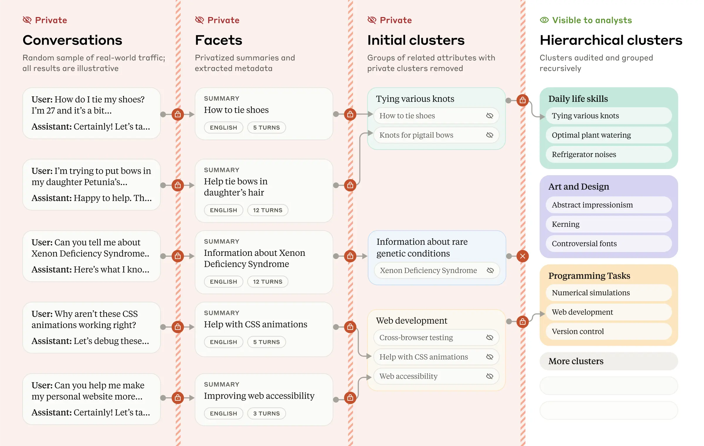
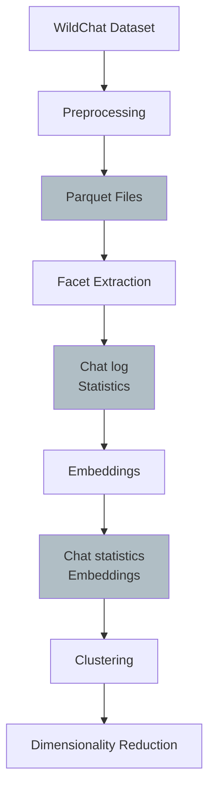

# RDS chat log analysis - Week 1

**General Idea**:
Create a pipeline to do privacy-preserving chat log analysis over syft-RDS.

- Initial demo: WildChat dataset

## References

- Wildchat 1M Dataset: https://huggingface.co/datasets/allenai/WildChat-1M
- Anthropic CLIO paper: https://arxiv.org/pdf/2412.13678

## Plan

## Steps

**Syft-RDS steps**

1.  DO creates mock and real dataset + mock/real LLM credentials
2.  DS develops facet extraction against mock data + mock LLM credentials
3.  DS submits CLIO pipeline

    - facet extraction
    - facet embedding
    - clustering, hierarchical clustering, cluster description generation
    - UMAP projection to R2
    - return cluster descriptions, cluster assignments, UMAP coordinates, non-private facets (e.g. num_turns, language, model, etc.)

**DS Local steps**

1. DS makes visualizations

## High level tasks

- [ ] Setup RDS locally with correct mock, private datasets and credentials
- [ ] Implement minimal CLIO pipeline over RDS
- [ ] Visualization of results
- [ ] Deploy Syftbox + RDS to (probably) GCP
  - [ ] Discuss with stakeholders how/where they want to deploy
  - [ ] Discuss credential management, data access + format, ... with stakeholder
  - [ ] LLM access with enough capacity, embedder GPU deployment, ...
- [ ] Discuss exact pipeline, database, LLM, embedder, ... with stakeholder
